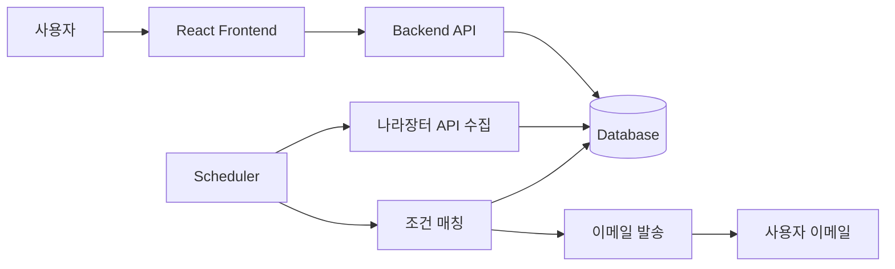

# 시스템 개요

## 구성 요소

- Frontend: React 기반 사용자 화면
- Backend API: 사용자 정보, 관심 조건, 조회 요청 처리
- Collector: 나라장터 공공 API 데이터 수집
- Matcher: 수집 공고와 사용자 조건 비교
- Email Sender: 매칭 결과 이메일 발송
- Database: 사용자, 조건, 공고, 매칭 결과, 발송 이력 저장

## 기본 흐름

## TBD

- 백엔드 프레임워크 확정
- 스케줄러 실행 위치
- 이메일 발송 제공자
- 운영 배포 환경
