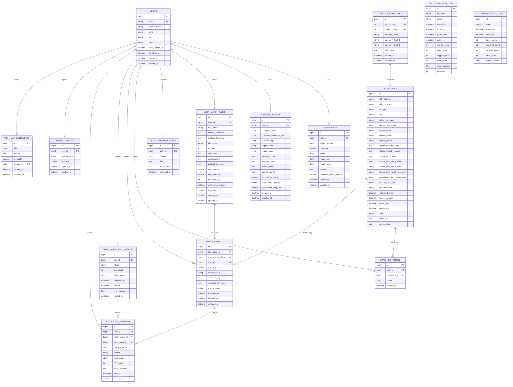

# ERD

BidMatch MVP 기준 ERD입니다.

```mermaid
erDiagram
    USERS ||--|| USER_PROFILES : has
    USERS ||--|| COMPANY_PROFILES : owns
    USERS ||--o{ USER_MATCH_RULES : creates
    USERS ||--o{ USER_SEARCH_HISTORIES : searches
    USERS ||--o{ SAVED_BID_NOTICES : saves
    USERS ||--o{ MATCH_RESULTS : receives
    USERS ||--o{ EMAIL_NOTIFICATION_BATCHES : receives
    USERS ||--o{ EMAIL_SEND_HISTORIES : receives
    USERS ||--o{ USER_CONSENTS : agrees
    USERS ||--o{ ADMIN_ANNOUNCEMENTS : writes

    BID_NOTICES ||--o{ SAVED_BID_NOTICES : saved_as
    BID_NOTICES ||--o{ MATCH_RESULTS : matched_by
    PRODUCT_CATEGORIES ||--o{ BID_NOTICES : classifies

    USER_MATCH_RULES ||--o{ MATCH_RESULTS : produces

    EMAIL_NOTIFICATION_BATCHES ||--o{ EMAIL_SEND_HISTORIES : contains
    MATCH_RESULTS ||--o{ EMAIL_SEND_HISTORIES : sent_as

    USERS {
        bigint id PK
        string email UK
        string password_hash
        string name
        string role
        string status
        datetime email_verified_at
        datetime last_login_at
        datetime created_at
        datetime updated_at
    }

    USER_PROFILES {
        bigint id PK
        bigint user_id FK
        string phone_number
        smallint birth_year
        string gender
        string region_code
        string region_name
        json interests
        boolean notification_email_enabled
        datetime created_at
        datetime updated_at
    }

    COMPANY_PROFILES {
        bigint id PK
        bigint user_id FK
        string company_name
        string business_registration_no
        string business_type
        string region_code
        string region_name
        text industry_codes
        text industry_names
        text license_codes
        text license_names
        boolean is_youth_company
        boolean is_woman_company
        boolean is_disabled_company
        datetime created_at
        datetime updated_at
    }

    USER_MATCH_RULES {
        bigint id PK
        bigint user_id FK
        string rule_name
        text include_keywords
        text exclude_keywords
        string biz_types
        text regions
        text industries
        text organizations
        text product_class_nos
        decimal min_amount
        decimal max_amount
        int deadline_days
        boolean notification_enabled
        boolean is_active
        datetime created_at
        datetime updated_at
    }

    BID_NOTICES {
        bigint id PK
        string bid_notice_no
        string bid_notice_ord
        string biz_type
        string title
        string notice_org_name
        string demand_org_name
        string region_name
        string industry_code
        string industry_name
        text eligible_industry_codes
        text eligible_industry_names
        json license_limit_items
        json license_limit_raw_payload
        string license_limit_result_code
        string license_limit_result_message
        string product_category_source_type
        string product_class_no
        string product_name
        decimal estimated_price
        decimal budget_amount
        datetime posted_at
        datetime deadline_at
        string status
        text detail_url
        json raw_payload
    }

    PRODUCT_CATEGORIES {
        bigint id PK
        string source_type UK
        string product_class_no UK
        string category_depth_1
        string category_depth_2
        string category_depth_3
        text description
        datetime created_at
        datetime updated_at
    }

    COLLECTION_RUN_LOGS {
        bigint id PK
        string job_name
        string status
        datetime started_at
        datetime ended_at
        datetime query_from
        datetime query_to
        int fetched_count
        int saved_count
        int skipped_count
        int error_count
        text error_message
        json metadata
    }

    LICENSE_BACKFILL_LOGS {
        bigint id PK
        string status
        datetime started_at
        datetime ended_at
        int target_count
        int enriched_count
        int no_data_count
        int error_count
        json sample_errors
    }

    MATCH_RESULTS {
        bigint id PK
        bigint bid_notice_id FK
        bigint user_match_rule_id FK
        bigint user_id FK
        decimal match_score
        string match_status
        text matched_keywords
        text excluded_keywords
        string match_reason
        datetime matched_at
        datetime created_at
        datetime updated_at
    }

    EMAIL_NOTIFICATION_BATCHES {
        bigint id PK
        bigint user_id FK
        string subject
        int total_count
        string send_status
        datetime scheduled_at
        datetime sent_at
        text error_message
        datetime created_at
    }

    EMAIL_SEND_HISTORIES {
        bigint id PK
        bigint user_id FK
        bigint match_result_id FK
        bigint email_batch_id FK
        string recipient_email
        string subject
        string send_status
        int retry_count
        text error_message
        datetime sent_at
        datetime created_at
    }

    USER_SEARCH_HISTORIES {
        bigint id PK
        bigint user_id FK
        string keyword
        json filters
        int result_count
        datetime searched_at
    }

    SAVED_BID_NOTICES {
        bigint id PK
        bigint user_id FK
        bigint bid_notice_id FK
        string memo
        datetime created_at
    }

    USER_CONSENTS {
        bigint id PK
        bigint user_id FK
        string consent_type
        boolean is_agreed
        datetime agreed_at
        datetime revoked_at
    }

    ADMIN_ANNOUNCEMENTS {
        bigint id PK
        string title
        text content
        boolean is_visible
        bigint created_by FK
        datetime created_at
        datetime updated_at
    }
```
