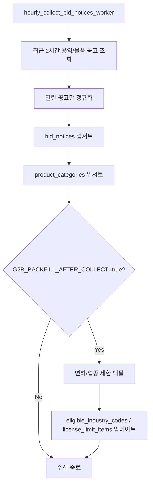

# 나라장터 OpenAPI 수집 대상 및 실행 정책

BidMatch는 나라장터 입찰공고정보서비스에서 열린 공고를 수집하고, 사용자 조건 매칭에 필요한 데이터만 정규화해서 저장합니다.

외자 API는 현재 서비스 범위에서 제외합니다.

## 1. 수집 정책

| 항목 | 기준 |
| --- | --- |
| 기본 수집 주기 | 1시간마다 실행 |
| 기본 조회 범위 | 현재 시각 기준 최근 2시간 |
| 기본 수집 대상 | 용역, 물품 공고 |
| 저장 대상 | 입찰마감일시가 현재보다 미래인 열린 공고 |
| 중복 처리 | `bidNtceNo + bidNtceOrd + bizType` 기준 업서트 |
| 상세 확인 방식 | `detail_url` 저장 후 공고명 링크로 나라장터 상세 화면 이동 |
| 첨부파일 저장 | MVP에서는 파일 저장하지 않음 |
| 물품 카테고리 | 조달분류번호와 대/중/소분류명을 `product_categories`에 별도 저장 |
| 업종/면허 보강 | 별도 백필 로직으로 제한 건수만 실행 |
| 요청 제한 대응 | 요청 간 지연, 429 재시도, 백필 건수 제한 |

## 2. 기본 수집 API

| 우선순위 | API | 대상 | 사용 여부 | 목적 |
| --- | --- | --- | --- | --- |
| 1 | `getBidPblancListInfoServc` | 용역 공고 목록 | 필수 | IT, SI, 개발, 운영, 연구용역 등 주요 공고 수집 |
| 1 | `getBidPblancListInfoThng` | 물품 공고 목록 | 필수 | 물품/공공조달 분류 기반 공고 수집 |
| 2 | `getBidPblancListInfoEtc` | 기타 공고 목록 | 선택 | 용역/물품 외 공고 보완 |
| 제외 | `getBidPblancListInfoFrgcpt` | 외자 공고 목록 | 제외 | 현재 서비스 범위 제외 |

## 3. 보강 API

기본 수집 API만으로는 업종/면허 제한 전체가 내려오지 않는 경우가 많습니다. 따라서 공고 저장 후 제한된 건수만 별도 보강합니다.

| API | 사용 | 목적 |
| --- | --- | --- |
| `getBidPblancListInfoLicenseLimit` | 필수 보강 | 입찰 가능 업종/면허 제한 저장 |
| `getBidPblancListInfoPrtcptPsblRgn` | 후속 보강 후보 | 참가 가능 지역 정밀 저장 |
| `getBidPblancListInfoThngPurchsObjPrdct` | 후속 보강 후보 | 물품 구매대상물품 정밀 저장 |
| `getBidPblancListInfoServcPurchsObjPrdct` | 후속 보강 후보 | 용역 공고의 구매대상/품목 보강 |
| `getBidPblancListInfoEorderAtchFileInfo` | 보류 | 상세 URL만으로 부족할 때 검토 |

## 4. 실제 실행 구조



## 5. 백엔드 실행 명령

1시간 주기 자동 수집 worker:

```powershell
python -m jobs.hourly_collect_bid_notices_worker
```

수동 1회 수집:

```powershell
python -m jobs.collect_bid_notices_job
```

업종/면허 제한 보강만 별도 실행:

```powershell
python -m jobs.backfill_license_limits_job
```

특정 공고의 면허제한 API 응답 확인:

```powershell
python -m jobs.debug_license_limit_job R26BK01574802 000
```

## 6. 환경 변수

| 이름 | 기본값 | 설명 |
| --- | --- | --- |
| `G2B_API_KEY` | 없음 | 공공데이터포털 ServiceKey |
| `G2B_API_BASE_URL` | `http://apis.data.go.kr/1230000/ad/BidPublicInfoService` | 나라장터 API 기본 URL |
| `G2B_COLLECT_ENDPOINTS` | `getBidPblancListInfoServc,getBidPblancListInfoThng` | 기본 수집 API 목록 |
| `G2B_INQRY_DIV` | `1` | 기본 수집 조회 구분 |
| `G2B_LOOKBACK_HOURS` | `2` | 매 실행 시 최근 몇 시간 조회할지 |
| `G2B_NUM_OF_ROWS` | `100` | API 페이지당 조회 건수 |
| `G2B_COLLECT_INTERVAL_SECONDS` | `3600` | 자동 수집 반복 간격 |
| `G2B_COLLECT_RUN_ON_START` | `true` | worker 시작 시 즉시 수집 여부 |
| `G2B_BACKFILL_AFTER_COLLECT` | `true` | 기본 수집 후 보강 백필 실행 여부 |
| `G2B_LICENSE_BACKFILL_LIMIT` | `20` | 1회 보강 처리 건수 |
| `G2B_REQUEST_DELAY_SECONDS` | `1.0` | API 요청 전 기본 대기 |
| `G2B_MAX_RETRIES` | `3` | 429 발생 시 최대 재시도 횟수 |
| `G2B_RETRY_BASE_DELAY_SECONDS` | `5.0` | 429 재시도 기본 대기 시간 |

## 7. 운영 메모

- 나라장터 API는 호출 제한이 있으므로 보강 백필은 작은 건수로 나누어 실행합니다.
- `429 Too Many Requests`가 발생하면 `G2B_LICENSE_BACKFILL_LIMIT`를 낮추거나 `G2B_REQUEST_DELAY_SECONDS`를 늘립니다.
- 기본 공고 수집과 업종/면허 보강은 논리적으로 분리되어 있으며, 운영 환경에서는 `G2B_BACKFILL_AFTER_COLLECT`로 함께 실행할지 조절합니다.
- 수집한 공고의 원본 응답은 `bid_notices.raw_payload`에 저장합니다.
- 조달분류번호와 대/중/소분류명은 `product_categories`에 중복 없이 저장하고, 공고는 `(product_category_source_type, product_class_no)`로 참조합니다.
- 면허제한 API 원본 응답은 `bid_notices.license_limit_raw_payload`에 저장합니다.
