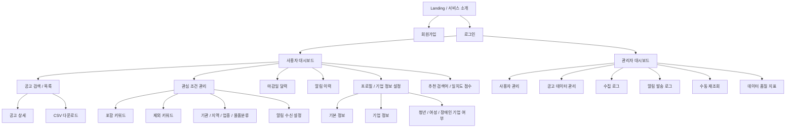

# 페이지 구조

요구사항 통합 문서(`01-requirements/consolidated-requirements-list.md`)를 기준으로 정리한 BidMatch 프론트엔드 페이지 구조입니다.

## 전체 페이지 도식



## 사용자 페이지

- `Landing / 서비스 소개`: 서비스 개요, 핵심 기능, 로그인/회원가입 진입점
- `회원가입`: 이메일, 비밀번호, 사용자명 입력 및 약관/개인정보/이메일 수신 동의
- `로그인`: 이메일/비밀번호 로그인, 토큰 발급
- `사용자 대시보드`: 관심 공고 요약, 마감 임박 공고, 추천 검색어, 최근 알림
- `공고 검색 / 목록`: 공고명, 기관, 공고일, 입찰일, 금액, 물품분류 기준 검색
- `공고 상세`: 공고번호, 기관, 수요기관, 금액, 공고일, 개찰일, 원본 링크 표시
- `관심 조건 관리`: 포함/제외 키워드, 기관, 지역, 업종, 물품분류, 알림 설정 관리
- `마감일 달력`: 관심 공고와 매칭 공고의 마감일 표시
- `알림 이력`: 이메일 발송 이력, 성공/실패 상태, 오류 사유 확인
- `프로필 / 기업 정보 설정`: 기본 정보, 기업 정보, 기업 유형 조건 관리

## 관리자 페이지

- `관리자 대시보드`: 사용자, 공고, 수집, 발송 상태 요약
- `사용자 관리`: 회원 정보와 구독 상태 조회
- `공고 데이터 관리`: 수집된 공고와 물품분류 관리
- `수집 로그`: 배치 실행 결과, 수집 건수, 오류 메시지 확인
- `알림 발송 로그`: 이메일 발송 성공/실패 내역 확인
- `수동 재조회`: 관리자가 나라장터 데이터를 즉시 재조회
- `데이터 품질 지표`: 중복 의심, 누락 의심, 파싱 실패 확인

## 디자인 생성 AI 추천

프론트엔드는 React를 사용할 예정이므로, 초기 화면 디자인 생성 도구로 `Vercel v0`를 우선 추천합니다.

- React 컴포넌트 기반 UI 생성에 적합합니다.
- Tailwind CSS, shadcn/ui 스타일의 업무용 화면을 빠르게 뽑기 좋습니다.
- 대시보드, 테이블, 필터, 상태 배지 같은 SaaS형 UI 생성에 잘 맞습니다.

## v0 입력용 기본 프롬프트

```text
공공입찰 알림 서비스 BidMatch의 React 대시보드 UI를 만들어줘.

주요 사용자는 공공입찰 공고를 찾는 기업 담당자야.
화면은 업무용 SaaS 느낌으로 차분하고 정보 밀도가 높게 구성해줘.

필요한 화면:
- 사용자 대시보드
- 공고 검색/목록
- 공고 상세
- 관심 조건 관리
- 마감일 달력
- 알림 이력
- 프로필/기업 정보 설정
- 관리자 대시보드

디자인 스타일:
- React + Tailwind 기준
- 사이드바 네비게이션
- 상단 검색바
- 테이블 중심 레이아웃
- 상태 배지, 필터, 카드형 요약 지표 포함
- 과한 랜딩페이지 느낌은 빼고 실제 업무 도구처럼 만들어줘
```
