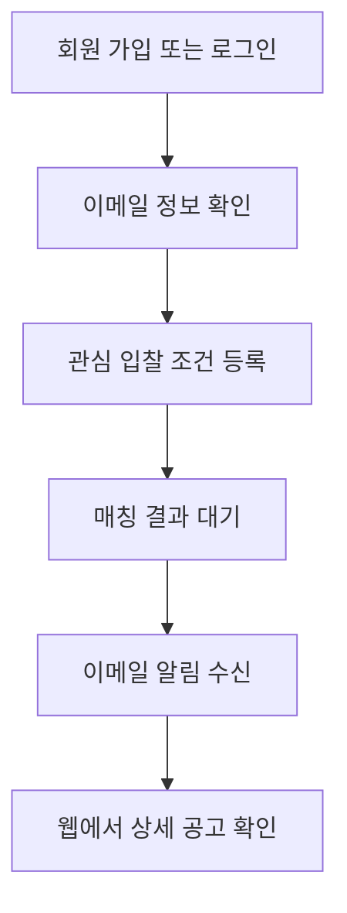

# 사용자 흐름

## 기본 흐름

```mermaid
flowchart TD
    A[회원 가입 또는 로그인] --> B[이메일 정보 확인]
    B --> C[관심 입찰 조건 등록]
    C --> D[매칭 결과 대기]
    D --> E[이메일 알림 수신]
    E --> F[웹에서 상세 공고 확인]
```

## 주요 화면

- 로그인/회원 가입 화면
- 대시보드
- 관심 조건 관리 화면
- 입찰 공고 목록/상세 화면
- 이메일 발송 이력 화면
- 사용자 설정 화면
